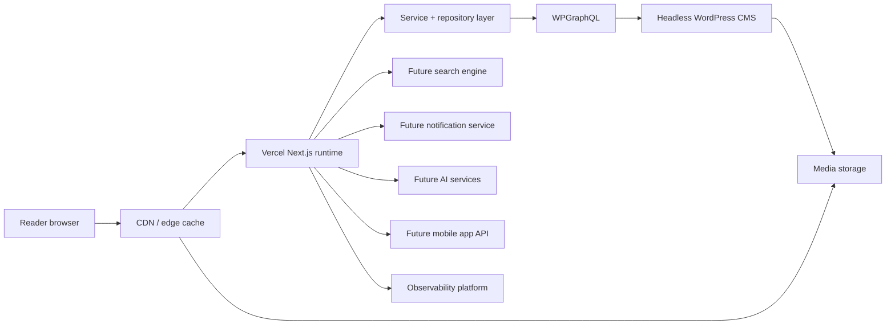
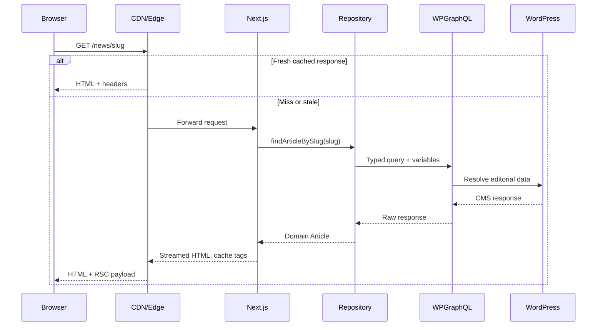
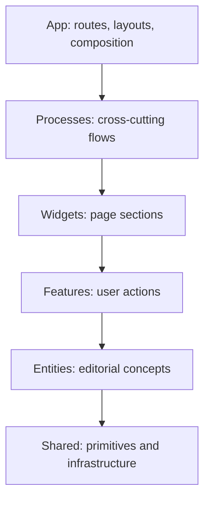
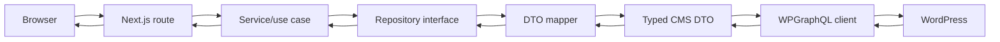

# DailySamachar Engineering Architecture Handbook

**Status:** normative engineering standard  
**Audience:** all engineers, reviewers, technical writers, SREs, and vendors contributing to DailySamachar  
**Scope:** the Next.js application, its CMS integration, delivery platform, and planned companion services  
**Owner:** DailySamachar Web Platform team  
**Review cadence:** quarterly and whenever a platform boundary changes

This document is the single source of truth for architectural decisions. A pull request may improve a rule, but it must either update this document or link to an accepted Architecture Decision Record (ADR). Examples are illustrative unless marked **MUST**, **MUST NOT**, **SHOULD**, or **MAY**. RFC 2119 terminology is used deliberately.

## Table of contents

1. [Project Vision](#1-project-vision)
2. [High-Level Architecture](#2-high-level-architecture)
3. [Folder Structure](#3-folder-structure)
4. [Feature-Sliced Design](#4-feature-sliced-design)
5. [Naming Conventions](#5-naming-conventions)
6. [Component Rules](#6-component-rules)
7. [State Management Rules](#7-state-management-rules)
8. [Data Flow](#8-data-flow)
9. [API Layer](#9-api-layer)
10. [Styling Guidelines](#10-styling-guidelines)
11. [Motion Guidelines](#11-motion-guidelines)
12. [Performance Standards](#12-performance-standards)
13. [SEO Standards](#13-seo-standards)
14. [Accessibility Standards](#14-accessibility-standards)
15. [Security Standards](#15-security-standards)
16. [Error Handling](#16-error-handling)
17. [Testing Strategy](#17-testing-strategy)
18. [Git Workflow](#18-git-workflow)
19. [CI/CD](#19-cicd)
20. [Documentation Standards](#20-documentation-standards)
21. [Coding Standards](#21-coding-standards)
22. [Future Roadmap](#22-future-roadmap)
23. [Anti-Patterns](#23-anti-patterns)
24. [Engineering Checklists](#24-engineering-checklists)
25. [Definition of Done](#25-definition-of-done)

---

## 1. Project Vision

### 1.1 Product goals

DailySamachar is a fast, trustworthy, multilingual-ready digital newsroom. The product publishes breaking news, explainers, opinion, video, galleries, fact checks, author pages, and live coverage from a headless WordPress editorial workflow. The web experience is the reference implementation for a future mobile application and notification surface.

The product MUST:

1. Render the primary story and its context before non-essential advertising or personalization.
2. Make publication time, author, corrections, sources, and editorial policy discoverable.
3. Remain useful on a slow connection, low-end Android device, keyboard, screen reader, or disabled-JavaScript browser.
4. Separate editorial content from presentation so the CMS can evolve without rewriting route components.
5. Make every user-visible failure recoverable and observable.

### 1.2 Architecture philosophy

- **Content is data.** WordPress responses are mapped to stable domain models; components do not know GraphQL field names.
- **Boundaries are explicit.** Routes, services, repositories, and providers have one-way dependencies.
- **Server-first.** Server Components perform read-heavy work; Client Components are islands around interaction.
- **Progressive enhancement.** Core reading and navigation work without animation, analytics, or client cache hydration.
- **Predictable change.** A feature has a clear owner, test seam, observability signal, and rollback path.
- **Boring infrastructure.** Prefer platform primitives in Next.js, Vercel, Cloudflare, and WordPress over bespoke runtime code.

### 1.3 Scalability goals

| Dimension                |        Target | Design consequence                                                                  |
| ------------------------ | ------------: | ----------------------------------------------------------------------------------- |
| Monthly page views       |          100M | CDN-first HTML and image caching; origin is not in the hot path for anonymous reads |
| Concurrent readers       |          250k | Stateless web tier; no per-request in-memory session assumption                     |
| CMS articles             |           10M | Cursor pagination, indexed filters, bounded query depth                             |
| Engineering organization |      8+ teams | FSD ownership, CODEOWNERS, ADRs, dependency linting                                 |
| Deployments              |        20/day | Preview environments and backwards-compatible contracts                             |
| Availability             | 99.9% monthly | Graceful degradation when CMS, search, or analytics is unavailable                  |

### 1.4 Maintainability goals

- TypeScript strict mode has zero `any` additions without an ADR.
- Every service has an interface and one composition-root implementation.
- Every route has loading, error, not-found, metadata, and analytics behavior defined.
- Shared primitives remain domain-neutral; editorial concepts live in entities/features.
- A new contributor can run, test, and preview the app using the README in under 15 minutes.

### 1.5 Performance goals

Targets are measured at the 75th percentile on mobile field data:

| Metric              |            Green |               Action threshold |
| ------------------- | ---------------: | -----------------------------: |
| LCP                 |          ≤ 2.5 s |                        > 2.5 s |
| INP                 |         ≤ 200 ms |                       > 200 ms |
| CLS                 |           ≤ 0.10 |                         > 0.10 |
| TTFB                |         ≤ 800 ms |                       > 800 ms |
| Initial JS (route)  |    ≤ 150 kB gzip |                  > 200 kB gzip |
| Article image bytes | ≤ 250 kB typical | > 500 kB without justification |

### 1.6 SEO goals

Every indexable article, category, author, and tag route MUST have unique metadata, a canonical URL, structured data where applicable, and a crawlable HTML representation. News freshness must be represented by publication and modification timestamps, not by changing URLs unnecessarily.

### 1.7 Accessibility goals

The product targets WCAG 2.2 AA. New work MUST be keyboard-complete, screen-reader understandable, color-independent, zoom-safe to 200%, and usable with `prefers-reduced-motion`. Accessibility defects that block navigation or reading are release blockers.

### 1.8 Developer experience goals

The default workflow is `npm ci`, `npm run dev`, `npm run lint`, `npm test`, and `npm run build`. The repository uses Next.js 15, React 19, TypeScript, Tailwind CSS 4, Framer Motion, Vitest, Testing Library, and Playwright. React Query, React Hook Form, Zod, and next-intl are available for approved use cases; each remains behind a bounded feature or provider.

### 1.9 Security goals

Protect reader privacy, CMS credentials, preview tokens, author data, and operational telemetry. Treat WordPress HTML, URLs, image metadata, query parameters, cookies, and third-party scripts as untrusted input. Security controls are defense in depth: validation, sanitization, CSP, least privilege, isolation, logging, and dependency hygiene.

---

## 2. High-Level Architecture

### 2.1 System context



### 2.2 Request and cache topology



### 2.3 Runtime boundaries

| Boundary        | Responsibility                                           | Failure behavior                   |
| --------------- | -------------------------------------------------------- | ---------------------------------- |
| Browser         | Input, interaction, local preferences, rendering islands | Preserve readable server HTML      |
| CDN             | Cache public HTML, RSC, images, static assets            | Serve stale content where safe     |
| Next.js         | Routing, rendering, metadata, composition                | Route error boundary and telemetry |
| Service         | Use-case orchestration, policy, cache intent             | Typed domain error                 |
| Repository      | Transport and CMS query details                          | Timeout, retry only safe reads     |
| WPGraphQL       | Editorial query API                                      | Fallback adapter or cached result  |
| WordPress       | Authoring, media, taxonomy                               | Never exposed directly to browser  |
| Future services | Search, AI, notifications, recommendations               | Feature flag and graceful omission |

### 2.4 Architectural invariants

1. Browser code MUST NOT call WordPress directly.
2. A route MUST NOT import GraphQL documents or CMS DTOs directly.
3. Cache invalidation MUST be event- or tag-driven, never a blanket purge by default.
4. Third-party scripts MUST be consent-aware and loaded after the reading path.
5. AI output MUST never silently replace verified editorial copy.

---

## 3. Folder Structure

The current repository is transitioning from legacy `src/components` folders to the FSD structure below. New code MUST use the target structure. Existing folders may be migrated incrementally with a small, reviewable change.

```text
.
├── ARCHITECTURE.md
├── CONTRIBUTING.md
├── next.config.ts
├── package.json
├── tsconfig.json
├── src
│   ├── app
│   │   ├── (site)
│   │   │   ├── page.tsx
│   │   │   ├── news/[slug]/page.tsx
│   │   │   └── category/[slug]/page.tsx
│   │   ├── api
│   │   │   └── revalidate/route.ts
│   │   ├── error.tsx
│   │   ├── global-error.tsx
│   │   ├── loading.tsx
│   │   ├── not-found.tsx
│   │   ├── layout.tsx
│   │   ├── robots.ts
│   │   ├── sitemap.ts
│   │   ├── manifest.ts
│   │   └── globals.css
│   ├── shared
│   │   ├── api
│   │   ├── config
│   │   ├── lib
│   │   ├── types
│   │   ├── ui
│   │   └── assets
│   ├── entities
│   │   ├── article
│   │   ├── author
│   │   ├── category
│   │   ├── media
│   │   └── taxonomy
│   ├── features
│   │   ├── bookmarks
│   │   ├── comments
│   │   ├── newsletter
│   │   ├── search
│   │   ├── share-article
│   │   └── auth
│   ├── widgets
│   │   ├── site-header
│   │   ├── breaking-news
│   │   ├── article-feed
│   │   ├── related-news
│   │   ├── ad-slot
│   │   └── site-footer
│   ├── processes
│   │   ├── app-init
│   │   ├── analytics
│   │   └── session
│   ├── services
│   │   ├── cms
│   │   ├── search
│   │   ├── notifications
│   │   └── telemetry
│   ├── providers
│   │   ├── query-provider.tsx
│   │   ├── theme-provider.tsx
│   │   └── locale-provider.tsx
│   ├── hooks
│   ├── constants
│   ├── config
│   ├── types
│   ├── animations
│   └── styles
├── public
│   ├── icons
│   ├── fonts
│   └── static
└── tests
    ├── unit
    ├── integration
    ├── e2e
    ├── a11y
    └── fixtures
```

### 3.1 Folder contracts

| Folder       | Purpose                                           | Allowed imports                     | Forbidden imports                           | Example files                              |
| ------------ | ------------------------------------------------- | ----------------------------------- | ------------------------------------------- | ------------------------------------------ |
| `app`        | Next.js routes, layouts, metadata, route handlers | Any lower layer                     | CMS calls, reusable business logic          | `news/[slug]/page.tsx`, `sitemap.ts`       |
| `shared`     | Domain-neutral primitives and infrastructure      | External packages, standard library | Entities, features, widgets                 | `shared/api/http.ts`                       |
| `entities`   | Stable editorial models and read views            | `shared`                            | Widgets, routes, unrelated features         | `entities/article/model.ts`                |
| `features`   | User-valued actions and workflows                 | `shared`, `entities`                | Direct app-to-app imports                   | `features/search/ui/search-form.tsx`       |
| `widgets`    | Composed page sections                            | `shared`, `entities`, `features`    | Raw GraphQL, global mutable state           | `widgets/article-feed/ui/article-feed.tsx` |
| `processes`  | Cross-cutting orchestration                       | Providers, services, shared         | Presentation-specific UI                    | `processes/analytics/analytics.tsx`        |
| `services`   | External systems and use-case orchestration       | `shared`, typed SDKs                | React UI, browser globals in server service | `services/cms/article-repository.ts`       |
| `providers`  | React context and runtime providers               | React, shared config                | Domain fetching                             | `providers/theme-provider.tsx`             |
| `hooks`      | Truly cross-cutting hooks                         | React, shared                       | Entity-specific policy                      | `hooks/use-media-query.ts`                 |
| `constants`  | Stable application constants                      | Primitive types                     | Runtime state                               | `constants/navigation.ts`                  |
| `config`     | Environment-derived configuration                 | `process.env`, validation           | JSX and request-specific data               | `config/env.ts`                            |
| `types`      | Cross-cutting TypeScript contracts                | TypeScript                          | Runtime implementations                     | `types/brand.ts`                           |
| `animations` | Motion variants and transitions                   | Framer Motion types                 | Business decisions                          | `animations/fade-in.ts`                    |
| `public`     | Immutable browser-addressable assets              | None                                | Secrets, generated user data                | `public/Logo.svg`                          |

### 3.2 Slice layout

Each entity, feature, and widget follows `ui/`, `model/`, `lib/`, `api/`, and `index.ts` only when needed. `index.ts` is a public API and MUST re-export intentionally. Deep imports across slices are forbidden.

```text
entities/article/
├── api/article-repository.ts
├── lib/article-presenter.ts
├── model/article.ts
├── model/article.test.ts
├── ui/article-byline.tsx
└── index.ts
```

---

## 4. Feature-Sliced Design

### 4.1 Layers



The arrow means “may import.” Reverse imports are architectural violations. A slice may import another slice in a lower layer only through its public API. Slices in the same layer MUST NOT import one another; extract shared behavior to the layer below or compose at the layer above.

### 4.2 Ownership rules

- Every slice has one owning team in `CODEOWNERS`.
- The owner reviews changes to its public API and data contract.
- A slice may expose data, UI, or actions, but never its private implementation path.
- A feature owns an action such as bookmarking; an entity owns the article model.
- A widget owns composition such as an article feed; it does not own search policy.

### 4.3 Import examples

```ts
// Good: route composes a widget through its public API.
import { ArticlePage } from "@/features/article";

// Good: widget consumes a stable entity contract.
import { ArticleCard } from "@/entities/article";

// Good: route uses the shared CMS facade.
import { cmsApi } from "@/shared/api/cms";

// Bad: one feature reaches into another feature's private file.
import { useBookmarkMutation } from "@/features/bookmarks/model/use-bookmark-mutation";
```

### 4.4 Migration policy

Legacy `src/components/*` code can remain during migration. A moved component gets a compatibility re-export for at most two releases. New imports must target the FSD location. Migration PRs must not mix visual redesign with boundary changes unless an ADR explains the coupling.

---

## 5. Naming Conventions

| Subject     | Rule                                 | Good                         | Bad                             |
| ----------- | ------------------------------------ | ---------------------------- | ------------------------------- |
| Folders     | lowercase kebab-case                 | `breaking-news`              | `BreakingNews`, `breaking_news` |
| React files | kebab-case                           | `article-card.tsx`           | `ArticleCard.tsx`               |
| Components  | PascalCase                           | `ArticleCard`                | `articleCard`, `Card`           |
| Hooks       | `use` + PascalCase                   | `useBookmark`                | `bookmarkHook`                  |
| Functions   | verb-first camelCase                 | `mapCmsArticle`              | `articleMapperThing`            |
| Booleans    | `is`, `has`, `can`, `should`         | `isPublished`                | `publishedFlag`                 |
| Constants   | UPPER_SNAKE_CASE                     | `MAX_PAGE_SIZE`              | `maxPageSize`                   |
| Types       | PascalCase nouns                     | `ArticleSummary`             | `IArticle`, `article_type`      |
| Interfaces  | Only for extension contracts         | `CmsAdapter`                 | `IRepository`                   |
| Enums       | Prefer string unions                 | `type Locale = 'hi' \| 'en'` | numeric enum                    |
| Classes     | PascalCase, rare                     | `CmsRequestError`            | `cms_error`                     |
| CSS classes | Tailwind utilities or semantic `ds-` | `ds-prose`                   | `.redText`                      |
| Icons       | Meaning + `Icon`                     | `ShareIcon`                  | `BlueIcon`                      |
| Images      | Content meaning, not appearance      | `heroImage`                  | `bigImage2`                     |
| Routes      | lowercase, nouns, dynamic `[slug]`   | `/news/[slug]`               | `/getNews`                      |

Names MUST describe business intent. Avoid `data`, `item`, `thing`, `temp`, `misc`, and unexplained abbreviations. `id` is acceptable only when the type makes its identity clear; prefer branded `ArticleId` at service boundaries.

---

## 6. Component Rules

### 6.1 Server and Client Components

Server Components are the default. They fetch public content, build metadata, and compose HTML. A component becomes client-side only for browser APIs, event handlers, local interactive state, or a client-only library. The `'use client'` directive MUST be at the smallest possible leaf.

```tsx
// Server Component
export async function ArticlePage({ slug }: { slug: string }) {
  const article = await articleService.getBySlug(slug);
  return <ArticleReader article={article} />;
}

// Client island
("use client");
export function ShareButton({ url }: { url: string }) {
  const handleShare = () => navigator.share?.({ url });
  return (
    <button type="button" onClick={handleShare}>
      Share
    </button>
  );
}
```

### 6.2 Composition and props

- Props are serializable across a server/client boundary.
- A component receives the smallest stable view model, not a repository response.
- Prefer composition (`children`, slots) over boolean prop explosion.
- Public props use explicit names and readonly types.
- Variants are constrained unions, not arbitrary class strings.
- Event props use `onVerb` names and are optional only when omission is meaningful.

### 6.3 Component categories

| Category           | Rule                                                    |
| ------------------ | ------------------------------------------------------- |
| UI primitive       | Domain-neutral, accessible, independently testable      |
| Business component | Knows one entity/feature contract, not transport        |
| Container          | Fetches or orchestrates; normally a Server Component    |
| Presentational     | Renders props; no data fetching or global mutation      |
| Widget             | Composes multiple features/entities into a page section |

### 6.4 Forbidden patterns

- A 500-line component with unrelated branches.
- Fetching in `useEffect` for route-critical server data.
- Rendering unsanitized CMS HTML with `dangerouslySetInnerHTML`.
- A generic `Button` with dozens of business-specific props.
- Layout shift caused by unknown image dimensions.
- Event handlers that mutate global state without an action boundary.

---

## 7. State Management Rules

| State                  | Owner             | Tool                                                    | Lifetime           |
| ---------------------- | ----------------- | ------------------------------------------------------- | ------------------ |
| Article/category reads | Server/repository | Next fetch cache; React Query for approved client reads | Request/cache      |
| Search query/filter    | URL               | `searchParams`, typed parser                            | Shareable URL      |
| Menu open, dialog      | Component         | `useState`                                              | Component          |
| Theme/locale           | Provider          | Context + cookie                                        | Session/persistent |
| Bookmark mutation      | Feature           | React Query mutation or server action                   | Account            |
| Auth/session           | Server boundary   | Secure cookie/session service                           | Session            |
| Draft preview          | Next request      | Draft mode cookie                                       | Preview session    |

### 7.1 Rules

1. URL state is canonical for filters, pagination, search, and sort.
2. Server state is not copied into Context or duplicated local state.
3. Context is for stable cross-cutting dependencies, not event buses or caches.
4. React Query keys are arrays of serializable, versioned primitives.
5. Local storage is optional enhancement; parse defensively and handle quota errors.
6. Cookies carrying identity or preview state MUST be `HttpOnly`, `Secure`, and `SameSite=Lax` or stricter.
7. Do not persist article content or PII in local storage.

---

## 8. Data Flow



### 8.1 Step contracts

1. **Browser:** sends a normalized route request; never selects arbitrary CMS fields.
2. **Next.js:** validates params and search params, selects loading/error boundaries, and creates metadata.
3. **Service:** applies use-case policy, authorization, cache intent, and fallback behavior.
4. **Repository:** hides transport, query documents, variables, timeout, and response status.
5. **Mapper:** converts nullable, CMS-specific shapes into domain invariants.
6. **DTO:** mirrors only the selected GraphQL fields; it is not a public UI model.
7. **GraphQL:** executes a bounded query against WPGraphQL.
8. **WordPress:** remains the editorial source of truth; its schema is not a browser contract.

### 8.2 Example mapping

```ts
type ArticleDto = { id: string; slug: string; title: string; date: string; featuredImage?: { node?: MediaDto } };

export function mapArticle(dto: ArticleDto): Article {
  return {
    id: ArticleId.parse(dto.id),
    slug: dto.slug,
    title: dto.title.trim(),
    publishedAt: parseIsoDate(dto.date),
    hero: dto.featuredImage?.node ? mapMedia(dto.featuredImage.node) : null,
  };
}
```

---

## 9. API Layer

### 9.1 GraphQL standards

- Store operation documents with the owning service/entity.
- Select explicit fields; never use broad fragments equivalent to `...PostFields` everywhere.
- Use variables for all user input and validate before execution.
- Enforce query depth, complexity, and page-size limits at the gateway/CMS.
- Version domain contracts through mappers, not by leaking schema versions into UI.

### 9.2 REST fallback

REST is permitted for webhook receivers, health checks, image transformations, and a CMS capability unavailable in WPGraphQL. The same repository and mapper rules apply. REST route handlers MUST validate method, origin, content type, body size, and authentication.

### 9.3 Repository contract

```ts
export interface ArticleRepository {
  findBySlug(slug: string, options?: ReadOptions): Promise<Result<Article, ArticleNotFound | CmsUnavailable>>;
  list(input: ArticleListInput): Promise<CursorPage<ArticleSummary>>;
}
```

Repositories MUST return domain errors, not `Response` objects or GraphQL error arrays. Services decide whether to retry, fall back, or show a not-found state.

### 9.4 Caching and revalidation

- Public article reads use tagged Next cache entries (`article:${id}`, `taxonomy:${slug}`).
- Webhook revalidation authenticates the secret, verifies event type, and invalidates the smallest tag set.
- Use `revalidate` for bounded freshness; use on-demand invalidation for breaking news.
- Do not cache personalized or draft responses in a shared CDN.
- `Cache-Control` must never permit private data to be stored publicly.

### 9.5 Reliability

| Concern    | Standard                                                          |
| ---------- | ----------------------------------------------------------------- |
| Timeout    | 3 s default CMS read, 10 s maximum background operation           |
| Retry      | At most 2 exponential retries for idempotent reads on 408/429/5xx |
| Jitter     | Full jitter to prevent synchronized retries                       |
| Pagination | Cursor-based for feeds; maximum 50 items per page                 |
| Filtering  | Whitelisted fields and operators only                             |
| Sorting    | Stable allow-list with deterministic tie-breaker                  |
| Search     | Debounced client input; server validates minimum/maximum length   |
| Preview    | Next Draft Mode, private no-store fetches                         |
| Errors     | Correlation ID, safe user message, structured internal context    |

### 9.6 Draft and preview mode

Preview endpoints MUST verify a signed secret and a known content identifier. Draft responses use `no-store`, bypass public cache, and include a visible preview indicator. Preview mode MUST be impossible to enable with a query parameter alone.

---

## 10. Styling Guidelines

Tailwind is the default styling language. Design tokens are the contract; utility classes express token usage. Use CSS modules only for third-party integration or genuinely complex selectors.

### 10.1 Tokens

```css
:root {
  --color-bg: 255 255 255;
  --color-fg: 17 24 39;
  --color-brand: 185 28 28;
  --space-unit: 0.25rem;
  --radius-card: 0.75rem;
  --shadow-card: 0 4px 24px rgb(15 23 42 / 0.08);
}
```

### 10.2 Rules

- Use the spacing scale; arbitrary values require a reason.
- Use a responsive mobile-first grid and constrain reading measure to 65–75 characters.
- Typography must define line-height, weight, and fallback fonts.
- Colors must pass contrast in normal, hover, disabled, and dark modes.
- Reserve shadows and rounded corners for semantic grouping, not decoration everywhere.
- Keep content layout stable while ads and images load.

### 10.3 Do and do not

| Do                                            | Do not                                   |
| --------------------------------------------- | ---------------------------------------- |
| `className="text-balance text-2xl font-bold"` | Inline style objects for static values   |
| Tokenized `gap-4` and `max-w-prose`           | Magic pixel values repeated across files |
| Semantic `aria` states                        | Color alone to communicate status        |
| `next/image` with dimensions                  | Raw `` for first-party content      |
| Dark-mode token overrides                     | Hard-coded white backgrounds             |

---

## 11. Motion Guidelines

Framer Motion is limited to meaningful feedback. Animation MUST not delay reading, navigation, or form submission.

| Motion            |                                Default |
| ----------------- | -------------------------------------: |
| Micro interaction |                             100–160 ms |
| Enter/exit        |                             180–240 ms |
| Page transition   |                             200–320 ms |
| Easing            | `easeOut` for enter, `easeIn` for exit |

Honor `prefers-reduced-motion` by reducing transforms to opacity or removing motion. Never animate layout for a screen-reader-only change. Hover effects require a focus equivalent and must not be the only affordance. Skeletons use a subtle pulse with a static fallback.

---

## 12. Performance Standards

### 12.1 Rendering strategy

| Content              | Strategy                                  | Rationale                                     |
| -------------------- | ----------------------------------------- | --------------------------------------------- |
| Home/news reads      | SSR + cache/ISR                           | Fresh content with CDN scale                  |
| Stable policy pages  | SSG                                       | No origin work per request                    |
| Personalized profile | SSR/no-store                              | Private data                                  |
| Search results       | SSR for initial query; client enhancement | Shareable and fast first result               |
| Live page            | Streaming + bounded polling               | Freshness without permanent sockets initially |

Use Suspense around independently slow widgets. Dynamic imports are required for heavy client-only editors, charts, and media players. Partial Prerendering is adopted only after measuring stable boundaries and cache behavior in production-like preview.

### 12.2 Images and bundles

- Use `next/image`, explicit dimensions or aspect ratios, modern formats, and responsive `sizes`.
- Preload only the LCP image; lazy-load below-the-fold media.
- Keep route-level client bundles below the stated budget.
- Import icon modules directly; do not import an entire icon package into a client island.
- Analyze bundles monthly and at every major dependency upgrade.

### 12.3 Edge runtime

Use Edge Runtime only for stateless, Web API-compatible work such as redirects or lightweight personalization. CMS SDKs, Node-only crypto, and long-running operations stay on the Node.js runtime. Every edge migration needs a compatibility test and latency comparison.

---

## 13. SEO Standards

Routes use the Next.js Metadata API. Titles are unique, concise, and localized when next-intl is enabled. Descriptions describe the page, not generic brand copy. Canonicals use the normalized public origin and remove tracking parameters.

### 13.1 Structured data

Articles emit `NewsArticle` with headline, image, datePublished, dateModified, author, publisher, and mainEntityOfPage. The site emits `Organization`; author pages emit `Person`; nested routes emit `BreadcrumbList`. JSON-LD is generated from validated domain models and escaped as a script-safe JSON string.

### 13.2 Crawl surfaces

- `robots.ts` blocks private, preview, account, and search query variants where appropriate.
- `sitemap.ts` includes canonical indexable routes and stable `lastModified` values.
- A news sitemap includes only eligible recent articles and is updated on publication.
- Open Graph and Twitter cards use the same validated image fallback hierarchy.
- Pagination links remain crawlable; infinite scroll is an enhancement, not the only path.

---

## 14. Accessibility Standards

WCAG 2.2 AA is the minimum. Use semantic landmarks (`header`, `nav`, `main`, `aside`, `footer`), one meaningful `h1`, logical heading order, and native controls before ARIA.

- Every interactive control is keyboard reachable and has a visible `:focus-visible` state.
- Dialogs trap focus, restore focus, and close with Escape when appropriate.
- Menus expose expanded and controlled relationships.
- Images have meaningful alt text or empty alt for decorative media.
- Tables have captions and header associations.
- Errors identify the field, explain correction, and are announced without stealing focus.
- Contrast and target size are verified in automated and manual tests.

Run axe in component tests and Playwright keyboard journeys in CI. Manual screen-reader checks are required for major navigation, article reading, authentication, and checkout-like forms.

---

## 15. Security Standards

### 15.1 Threat controls

| Threat         | Required control                                                                               |
| -------------- | ---------------------------------------------------------------------------------------------- |
| XSS            | Sanitize CMS HTML with an allow-list; never interpolate untrusted HTML                         |
| CSRF           | SameSite cookies, origin checks, and CSRF token for state-changing cross-origin-capable routes |
| CSP            | Nonce/hash-based scripts; avoid `unsafe-inline` and `unsafe-eval`                              |
| Injection      | Zod validation, parameterized GraphQL variables, allow-listed sort/filter                      |
| Secret leakage | Server-only env vars; never prefix secrets with `NEXT_PUBLIC_`                                 |
| Abuse          | Rate limit auth, search, preview, revalidation, and webhook endpoints                          |
| Auth bypass    | Explicit server authorization at the use-case boundary                                         |
| Supply chain   | Lockfile review, Dependabot, provenance where available                                        |

Environment variables are validated at startup and classified as public, server-only, or secret. Logs redact tokens, cookies, authorization headers, email addresses, and CMS credentials. Preview and revalidation secrets are rotated at least quarterly and immediately after suspected exposure.

---

## 16. Error Handling

### 16.1 Error taxonomy

```ts
type AppErrorCode =
  "NOT_FOUND" | "VALIDATION" | "UNAUTHORIZED" | "FORBIDDEN" | "RATE_LIMITED" | "DEPENDENCY_UNAVAILABLE" | "INTERNAL";
```

Errors carry a stable code, safe message, correlation ID, retryability, and optional cause. User interfaces map codes to helpful recovery actions; they do not display stack traces or GraphQL payloads.

### 16.2 Boundaries and recovery

Every route group defines `loading.tsx`, `error.tsx`, and `not-found.tsx` where relevant. Retry buttons re-run an idempotent operation and are disabled while pending. A CMS outage shows cached content, an explicit freshness note, or a useful empty state. Logging includes route, release, latency, status, dependency, and correlation ID.

---

## 17. Testing Strategy

| Test          | Tool                        | Scope                            | Gate                 |
| ------------- | --------------------------- | -------------------------------- | -------------------- |
| Unit          | Vitest                      | Mappers, parsers, pure utilities | Every PR             |
| Component     | Testing Library             | Semantics, interaction, states   | Every PR             |
| Integration   | Vitest/MSW or adapter fakes | Service + repository contracts   | Every PR             |
| E2E           | Playwright                  | Critical reader journeys         | PR + nightly         |
| Accessibility | axe + Playwright            | Violations and keyboard          | Every PR             |
| Performance   | Lighthouse/field telemetry  | Budgets and regressions          | Main + release       |
| Visual        | Playwright snapshots        | Stable visual surfaces           | Main, reviewed diffs |

### 17.1 Test rules

Test behavior and contracts, not implementation details. Prefer the real mapper and a fake `CmsAdapter` over mocking every module. Fixtures are minimal, deterministic, and representative of nullable CMS data. Snapshot tests are limited to stable serialized structures; never snapshot entire pages as the only assertion.

Coverage goals are 90% for pure domain logic, 80% for services, and meaningful branch coverage for error states. Coverage percentage never substitutes for an assertion of user behavior.

```text
tests/
├── unit/entities/article.test.ts
├── integration/services/article-service.test.ts
├── e2e/article-reading.spec.ts
├── a11y/navigation.spec.ts
└── fixtures/cms/article.json
```

---

## 18. Git Workflow

Trunk-based development with short-lived branches is the default. Branches use `feat/`, `fix/`, `perf/`, `refactor/`, `docs/`, or `chore/` followed by a short kebab-case identifier. Commits follow Conventional Commits (`feat(article): add related stories`).

Pull requests MUST state intent, scope, test evidence, rollout/rollback plan, screenshots for visual work, accessibility notes, and migration/ADR links. Two reviewers are required for security, data contracts, and shared primitives. Squash merge keeps the main branch releasable.

Releases use semantic versioning for packages and date-based release identifiers for the site. Hotfixes branch from the production tag, receive the same CI gates, and are merged back. Rollback means redeploying the last known-good immutable build, then invalidating affected cache tags only if necessary.

---

## 19. CI/CD

```mermaid
flowchart LR
  PR[Pull request] --> Lint[Lint + format check]
  Lint --> Type[Type check]
  Type --> Unit[Unit/integration tests]
  Unit --> A11y[Accessibility + E2E smoke]
  A11y --> Build[Production build]
  Build --> Preview[Preview deployment]
  Preview --> Review[Human review]
  Review --> Main[Protected main]
  Main --> Release[Release workflow]
  Release --> Prod[Production deployment]
  Prod --> Observe[Smoke + telemetry]
```



GitHub Actions MUST run on a pinned Node version with `npm ci`, dependency caching, least-privilege permissions, and concurrency cancellation for superseded PR runs. Required checks are lint, format, type check, tests, build, and security audit policy. Preview deployments use isolated environment variables and never production secrets. Production deploys require protected-branch approval, migration compatibility, and post-deploy smoke checks.

---

## 20. Documentation Standards

The README covers setup, scripts, environment variables, and deployment. Feature docs cover user behavior, data contract, flags, analytics, accessibility, and failure states. API docs include operation name, input/output types, cache policy, authorization, rate limit, and examples.

ADRs live in `docs/adr/ADR-NNNN-title.md` with status, context, decision, alternatives, consequences, and review date. Comments explain why, never restate what code says. Code examples compile or are clearly marked pseudocode. Documentation changes are reviewed like production code.

---

## 21. Coding Standards

TypeScript uses strict mode, explicit public return types for services, discriminated unions for outcomes, and no unsafe casts without a comment explaining the invariant. React components remain pure; hooks obey the Rules of Hooks; effects synchronize with external systems only.

Next.js routes use async Server Components, `generateMetadata`, `generateStaticParams` only where bounded, and route-level boundaries. Imports are absolute via the configured alias, sorted by formatter, and free of cycles. Prefer named exports for domain code; default exports are reserved for Next.js convention files.

Formatting is enforced by Prettier and lint by ESLint. Do not disable a rule inline without a narrowly scoped explanation. Avoid premature memoization; profile first, then use `memo`, `useMemo`, or `useCallback` where identity or computation cost is demonstrated.

---

## 22. Future Roadmap

| Phase | Deliverables                                                      | Exit criteria                                |
| ----- | ----------------------------------------------------------------- | -------------------------------------------- |
| 1     | Stabilize FSD boundaries, CMS adapter, metadata, tests            | All routes use typed domain models           |
| 2     | WPGraphQL production adapter, cache tags, webhook revalidation    | Freshness and outage drills pass             |
| 3     | React Query for approved interactive reads, next-intl, PWA shell  | Offline/read-later journeys are tested       |
| 4     | Cloudflare edge protections, search index, push notifications     | Rate limits, indexing, consent verified      |
| 5     | Mobile API, recommendations, AI-assisted workflows, realtime news | Human editorial controls and SLOs documented |

AI services may classify, summarize, translate, or recommend only with provenance, confidence, audit logs, privacy review, and human override. Mobile clients consume versioned service contracts rather than scraping web routes. Realtime news starts with polling or server-sent events; WebSockets require an operational owner and backpressure design.

---

## 23. Anti-Patterns

The following are forbidden unless an ADR grants a time-bounded exception:

1. Business logic inside presentational UI.
2. Deep prop drilling across more than two composition levels.
3. Giant components mixing fetching, mapping, layout, and mutation.
4. Circular dependencies between slices or services.
5. Inline styles for tokenizable design values.
6. Duplicate CMS clients or parallel API layers.
7. Hardcoded user-visible strings outside localization-ready boundaries.
8. Magic numbers for limits, animation, or layout.
9. Direct GraphQL imports from `app` or `widgets`.
10. Client-side fetching for content needed to index or read the page.
11. Global mutable singletons for request-specific state.
12. Unbounded `Promise.all` over user-controlled collections.
13. Retrying non-idempotent mutations automatically.
14. Disabling lint, type checking, or accessibility gates to merge.
15. Logging secrets, full request bodies, or raw CMS HTML.
16. Using array indexes as keys for reorderable or editorial lists.
17. Rendering ad slots without reserved dimensions.
18. Shipping a new third-party script without performance and privacy review.
19. Treating generated AI text as editorial truth without attribution.
20. Copying domain types into multiple feature-local variants without a mapper.

---

## 24. Engineering Checklists

### 24.1 New feature

- [ ] User outcome and owner identified.
- [ ] Slice and public API chosen.
- [ ] Domain types and failure states defined.
- [ ] Server/client boundary justified.
- [ ] URL, local, server, and persistent state classified.
- [ ] Analytics and privacy impact reviewed.
- [ ] Unit, integration, E2E, and accessibility coverage added.
- [ ] Metadata, responsive layout, reduced motion, and empty states verified.
- [ ] Documentation and ADR updated if a boundary changes.

### 24.2 New component

- [ ] Category is primitive, business, container, presentational, or widget.
- [ ] Props are minimal, serializable, and readonly.
- [ ] Semantic HTML and keyboard behavior implemented.
- [ ] Loading, error, empty, and disabled states designed.
- [ ] Story/example or focused test added.
- [ ] No transport or unrelated business logic included.

### 24.3 New route

- [ ] Params and search params validated.
- [ ] `loading`, `error`, `not-found`, and metadata behavior defined.
- [ ] Canonical, robots, JSON-LD, and social cards reviewed.
- [ ] Cache/revalidation policy documented.
- [ ] Core journey covered by E2E and accessibility tests.

### 24.4 New API/repository/service

- [ ] Contract and ownership documented.
- [ ] DTO, mapper, domain result, and error taxonomy added.
- [ ] Timeout, retry, rate limit, pagination, and cache policy specified.
- [ ] Input validation and authorization occur at the boundary.
- [ ] Logs and metrics use correlation IDs and redact sensitive data.
- [ ] Failure and dependency-unavailable tests included.

### 24.5 New hook

- [ ] Hook owns synchronization or reusable interaction, not arbitrary business policy.
- [ ] Dependencies are complete and stable.
- [ ] Browser-only assumptions are isolated.
- [ ] Cleanup and race conditions are tested.
- [ ] Hook does not duplicate server cache or URL state.

### 24.6 New widget/entity/GraphQL query

- [ ] Entity invariants and public API are explicit.
- [ ] Widget composition stays below its layer boundary.
- [ ] Query fields are minimal and bounded.
- [ ] Nullability, pagination, and schema failure are mapped.
- [ ] Cache tags and invalidation events are named.
- [ ] Fixtures represent realistic CMS omissions.

---

## 25. Definition of Done

A feature is complete only when all applicable statements are true:

- [ ] Type safe under strict TypeScript.
- [ ] Lint and formatting clean.
- [ ] Production build passes.
- [ ] Unit/integration tests pass.
- [ ] Critical E2E and accessibility journeys pass.
- [ ] Responsive from 320 px through large desktop.
- [ ] Keyboard, screen reader, contrast, focus, and reduced-motion behavior verified.
- [ ] SEO metadata and structured data are correct for indexable routes.
- [ ] Cache, revalidation, error, loading, empty, and outage behavior are documented.
- [ ] Security, privacy, secrets, and rate-limit implications reviewed.
- [ ] Performance budgets remain within target or have an approved exception.
- [ ] Reusable boundaries and public exports are intentional.
- [ ] Analytics events are specified, consent-aware, and tested where applicable.
- [ ] Documentation, changelog, and ADRs are current.
- [ ] Rollout, monitoring, and rollback steps are known.

The handbook is successful when an engineer can use it to make a correct change without guessing where code belongs, which contract to call, how failure behaves, or what evidence a reviewer needs.
